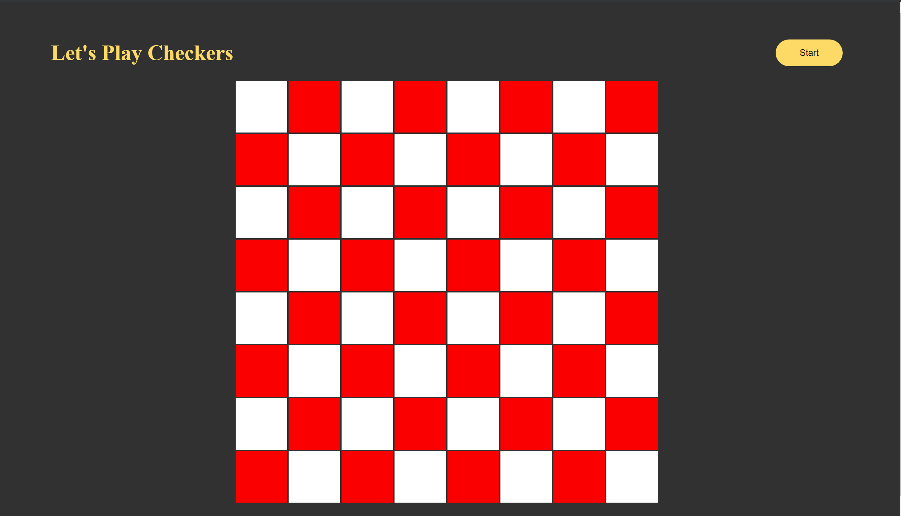
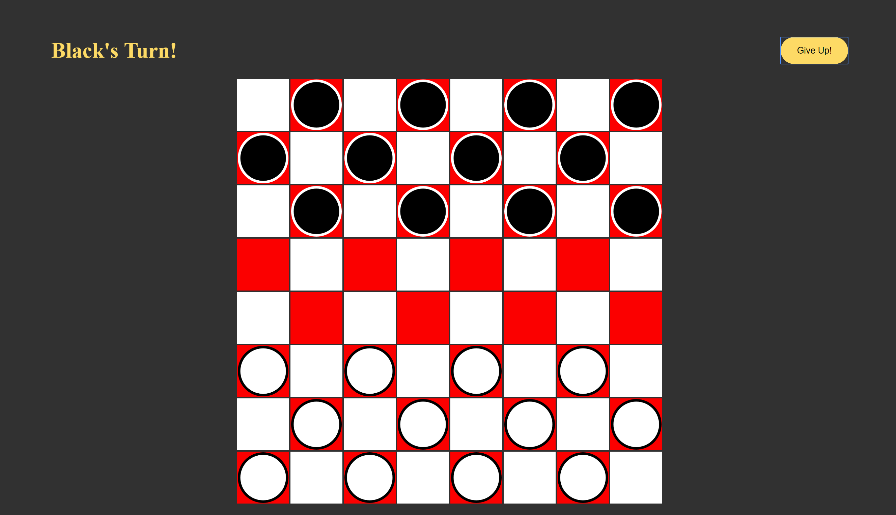
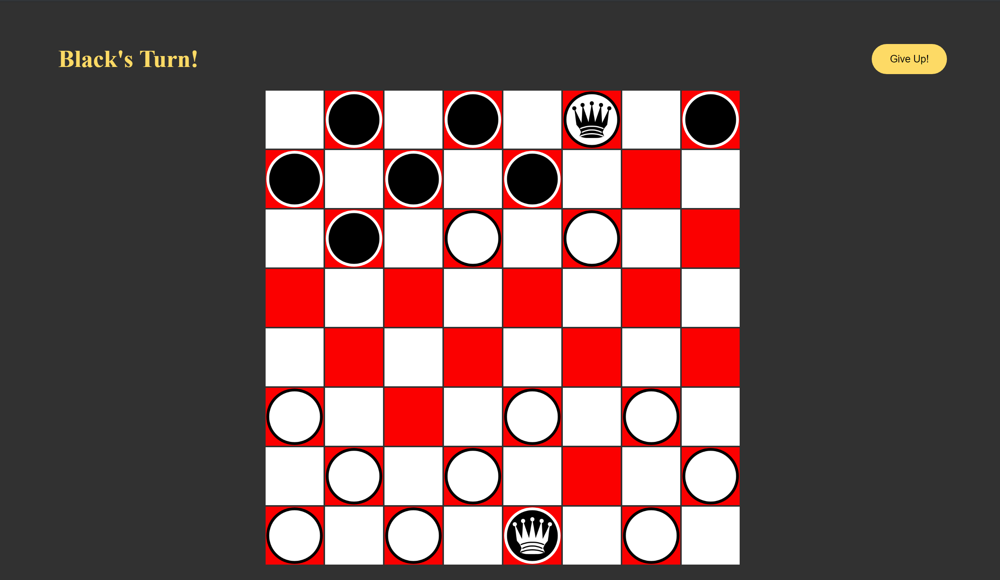

# Checkers

## Let's Play Checkers

### Technology
-  This project was coded in HTML/CSS/JavaScript
- JS Classes, Methods, Functions and other JS fun stuff was invloved in creating a really sleak and minimalistic checkers game.

### Object:
Remove all of your opponent's checkers from the gameboard by capturing them.

### How to play?
- Player 1 will go first.
- On your turn, move any one of your checkers by the movement rules described below. 
-- Click on piece to be moved then click on the space that you would like to move the piece to. 
- After you move one checker, your turn is over.  
- The game continues with players alternating turns.

### Movement Rules:
- Your piece will move _diagonally forward_, toward your opponent's side of the gameboard. Note: After a checker becomes a _"King,"_ it can move diagonally forward or backward.
- Move your checker one space diagonally, to an open adjacent square; or _jump_ one or more checkers diagonally to an open square sdjacent to the checker you jumped.  When you jump over an opponent's checker, you capture it.
- If all squares adjacent to your checker are occupied, your checker is _blocked_ and cannot move.

### Capturing an Opponent's Checker
- If you jump an opponent's checker, you capture it.  It will be removed from the gameboard, and your captured pieces counter will increase by 1 per checker jumped.

### Becoming a "King"
- As soon as one of your checkers reached the first row on your opponent's side of the gameboard, it becomes a "King". The "King" will be identified by a _Crown_ on the checker.  This "King" can not move forward or backward on the gameboard.

### Expanded Game Play
- A vertical jump function is included as an option for expanded game play to increase the Player vs Player difficulty.